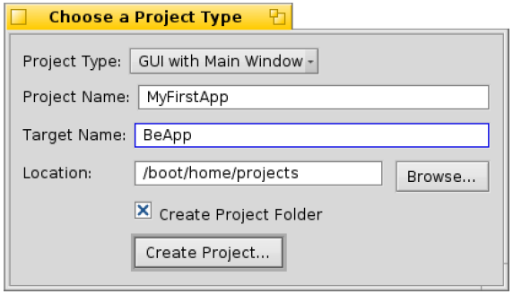
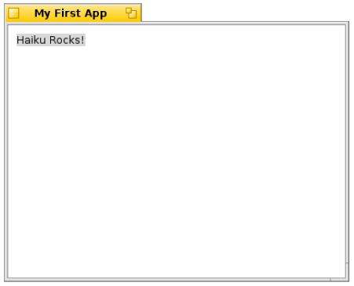

# 第十四课

如果您正在等待何时可以从编写终端程序转向图形程序，那么这一刻就是今天。我们需要大部分的时间来理解代码，但是首先我们需要了解那些工具和代码组织。

## 商业工具：集成开发环境

当前我们所有的程序都非常简单。控制台程序，如它们所称的那般，都是如此，但是对于语言的学习来说，简单最好。文本编辑器就是我们完成这些放置于单个文件中的简单程序所需要的全部工具。一般的程序可以有上百个文件。许多有经验的C++程序员仅需编辑器和终端就已足够，但是再多一些并非不好，尤其是对于入门的程序员。

对于余下的课程，我们鼓励您使用集成开发环境（IDE），但并不是必需的。集成开发环境将编译器，代码编辑器，调试器以及其他工具集成到一起，帮助程序员高效的开展工作。鉴于此，我们假定您使用Haiku的Paladin IDE。如果您喜好其他的工具，那也没有问题。

## 我们的首个项目

启动 Paladin，您将会进入启动窗口。选中创建新的项目。在 New Project 窗口的顶端有个菜单，您可以选择创建何种类型的项目。选择 Empty Application。虽然我们可以选择 GUI with Main Window 以自动创建我们所希望的内容，但是输入源码将有助于我们更好地了解 Haiku GUI 程序。项目的名称可以自由设置。Target Name 是当您的项目编译完成之后的可执行程序的名称，并且通常都是项目的名称。当您一切都准备妥当，点击 Creat Project。

在编写时，如果您使用的是基于 GCC4 构建的 Haiku 版本，您需要为您的项目添加一个库，以进行正常编译。在您的项目窗口中，在 Project 菜单中选择 Change System Libraries。向下查看，然后选中l ibsupc++.so 旁的选框。关闭窗口，然后从 Project 菜单中选择 Add New File。当询问您的文件名称时，输入 App.cpp，然后选中选框以创建相应的头文件，之后点击 OK。

通常，每对文件中都具有一个类，并且两者的基本名称与其中的类名是相同的。我们的首个文件，App.cpp 具有一个类：App。App 类的定义放置在 App.h 头文件中，所有其他的类代码放置于 App.cpp 中。如果我们有一对确实很小但关系紧密的类，那么可以将它们放置于同一个文件中，但是通常的组织规则就是每对文件中定义一个类。

首先，我们添加需要的内容到 App.h。在项目窗口中点击 App.cpp，将其选中，然后同时按下 `Alt + Tab` 键。这样，App.cpp 就出现在了一个编辑器中。`Alt-Tab` 组合键可以快速的在头文件和源文件中实现切换，但是仅当两个文件具有相同的基础名时才起作用，如 App.cpp 和 App.h。输入下述代码：

    // 这就是所谓的头文件保护符。它用于避免头文件多重包含造成的编译错误。
    // 如果您使用的是 Paladin，它将由您自行输入。您所定义的内容并不是非常的重要，但是对于项目中的每个头文件来说，它都是独立的，因此遵循这种格式还是非常有帮助的。
    #ifndefine APP_H
    #define APP_H
     
    // 该头文件放置了我们项目所需的 BApplication 类的定义。
    #include <Application.h>
     
    class App : public BApplication
    {
        public:
            App(void);
    };
     
    // 该行是头文件保护符的结尾，并且必须总是处于我们的头文件结尾。
    #endif

Haiku 操作系统中每个 GUI 程序都创建了一个 BApplication 的子类。该类定义了和 app_server 的交互，而后者则是系统中实际用于在屏幕上绘制任何内容，处理字体信息，以及许多其他任何的重要部分。如果没有这个连接，我们无法完成很多内容。

如果您还未执行这一步，请保存您的代码，切换到 App.cpp(`Alt+Tab`)，输入以下代码：

    // 包含了对我们的 App 类定义的头文件。这通常由Paladin完成添加。
    #include "App.h"
     
    // 包含了我们将要放置到项目窗口中的控件的两个头文件。
    #include <StringView.h>
    #include <Window.h>
     
    // 定义 App 类的构造函数。
    App::App(void)
        :   BApplication("application/x-vnd.dw-MyFirstApp")
    {
        // 创建tctangle以定义窗口的大小和位置。
        BRect frame(100,100,500,400);
     
        // 我们的窗口具有常规类型和“My First App"标题。
        // 当窗口关闭时，它将会退出程序。
        Bwindow *myWindow = new Bwindow(frame, "My First App",B_TITLED_WINDOW, B_QUIT_ON_WINDOW_CLOSE);
     
        // 我们再次使用 BRect 变量设置标签的位置。
        // 但是其确切的长宽并不重要。
        frame.Set(10,10,11,11);
     
        // 创建静态的文本标签，其文本显示为“Haiku Rocks!”。
        BStringView *label = new BstringView(frame,"mylabel","Haiku Rosks");
     
        // 让标签可以根据我们给与的文本自定义大小，
        // 这样可以避免手动的配置，节省很多的工作。
        label->ResizeToPreferred();
     
        // 将标签附着到我们的窗口。
        myWindow->AddChild(label);
     
        // 显示我们的窗口。
        myWindow->Show();
    }
     
    int 
    main(void)
    {
        // 创建我们的App类的实例。每个Haiku程序都仅有一个此实例。
        // 创建它以设置与app_server的连接。
        App *app = new App();
     
        // 下面将我们的应用程序启动，我们将无法退出该函数知道程序退出。
        app->Run();
     
        // 释放我们从内存堆中获取的内存。我们也可以在栈中创建，但是
        // BApplication 对象所需内存都比较大，因此最好使用堆进行创建。
        delete app;
     
        // 正常返回调用，结束编译器。;-)
        return 0;
    }

保存您的任务，从 Build 菜单点击 Run，或者按下 `Alt+R` 进行编译，然后运行您的项目。如果您的输入都正确，您可以看到下面的窗口：

## 第一个 APP

如果您的运行出错，请仔细检查，确保您的输入和上述的代码相一致。

我们已经完成了首个可以工作的 Haiku app！它不仅可以在屏幕上显示一些内容，还可以让我们自定义窗口大小，隐藏或关闭窗口，以及退出程序。它虽然没有很大用处，但是这已足矣。我们还需要很多东西需要学习，并且还要了解这些代码究竟做了什么。

有一小段代码并没有做出注释。如下：

    App::App(void)
        :   BApplication("application/x-vnd.dw-MyFirstApp")
		
双引号标记的部分可能不很熟悉。这就是所谓的 MIME 类型。MIME 的全称是 Multipurpose Internet Mail Extensions。Haiku 中的每个文件都有一个类型，包括所有的 Haiku 程序。Haiku 的图形程序和我们的程序一样也有特别的类型。请使用您的公司名称，您的在线主页，或者个人信息以替代 MyFirstApp 来作为程序的名称，同时仅需保证署名的开头为 “application/x-vnd."。这样可以确保其不与您的其他在线应用程序相混淆。

该项目仅仅是一个应用程序框架，介绍了创建一个简单窗口所需的最少代码。虽然看起来比较多，但是和 C++ 编写的窗口程序相比，它已经很短了。下一次，我们将会创建一个完成更多任务的窗口，但是目前来说，使用这些代码来做您力所能及的事，将会对加深代码的理解大有裨益。