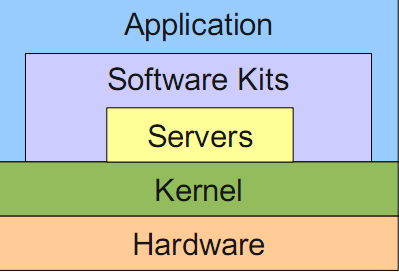

# 第十五课

既然我们已经编写了首个可以运行的 Haiku GUI 应用程序，我们将开始学习所谓的 Haiku API 的基础内容。

## Haiku API 概览

所有可供我们使用的操作系统库都进行了分门别类，称之为套件(kits)。有些套件具有与之相关的服务组件。有些没有。大多数的 Haiku 程序都使用这些套件，很少例外，唯独设备驱动直接操作硬件并调用内核函数。Haiku 操作系统层次分明，其“分层”如下：

在编写此文时，官方的套件如下所示：

* Application（应用套件）     
* Device（设备套件）	      
* Game（游戏套件）	          
* Interface（接口套件）	      
* Kernel（内核套件）	      
* Mail（邮件套件）	          
* Media（媒体套件）
* MIDI
* Network（网络套件）
* OpenGL
* Storage（存储套件）
* Support（支持套件）
* Transaltion（转换套件）

除了以上这些官方套件，还有两个正在开发之中，属于实验性质：Layout Kit 和 Locale Kit。这可能看起来多了些，但是它们确实是这样的，不过根据所要编写程序的不同，您很不需要使用某些套件。之后，我们将会仔细的了解一些套件，但是现在，我们主要关注 Application，Interface，和 Support 套件。

### Application 套件

Application 套件很小，但至关重要。该套件主要围绕着 BMessage 和 BApplication，前者是用于和程序及程序之间进行交互的方法，后者在编写使用 BMessages 的程序时必须使用子类。

### Device 套件

Device 套件提供了用于特定硬件的类。由于在该套件中仅有两个类，它不是经常使用，但是在未来的 Haiku 版本中会进行扩展。

### Game 套件

Game 套件基于以下假设，游戏编写者非常希望能够给予处理屏幕显示内存的直接访问 – 视频缓冲 –而且单独用于他们的黑色艺术。并且还有一些用于游戏声音播放的类以方便游戏编写者。

### Interface 套件

对于应用编写者，Interface 套件非常重要而且非常大。窗口，按键，复选框，以及其他在程序中出现的东西。打印也由这个套件进行处理。

### Kernel 套件

内核套件是仅有的非 C++ 类集合。相反，它有低级的 C 调用组成。

### Mail 套件

Mail 套件用于构造和发送邮件，对于它没有很多需要讨论的。

### Media 套件

Media套件全部用于音频和视频的处理。Haiku 在音频和视频的播放与记录方面非常出色，是其最基本的内容。

### MIDI 套件

MIDI，即 Musical Instrument Digital Interface，是摇滚时代建立的标准，其定义了如何让 musical instruments 和计算机进行交互的标准。MIDI 套件用于处理 MIDI 数据，和 Media 套件一样全部用于音频和视频的处理。

### Network 套件

如果您具有 UNIX 编程背景，您可能使用 C 函数调用进行网络编程。Network 套件的类以比较有好的方式用于网络交互的代码编写。

### OpenGL 套件

如果您进行 3D 图像处理，那么它正好适用。其中是有一个类，BGLView，但是它打开了 OpenGL 图形和您的应用的交互之门。

### Storage 套件

Storage 套件提供了友好的文件系统处理方式。除了文件的读取和写入，它还提供了一些用于读取目录，运行查询，以及属性处理的类。

### Support 套件

该套件设计为使用 helper 类支持其他的套件。BString，BList，Blocker 尤其有用，而且使用频繁。

### Translation 套件

Translation 套件是 Haiku 的特性之一：它提供了单一的接口用于读取和写入图像和文本而无需了解其底层文件格式。对于我们这些程序员而言，它让我们的生活更加简单。

## 基于事件的编程

编写用于控制台的程序非常简单，您作为开发者只需要控制运行的流程即可。但是对于 GUI 来说则不然，因为这些程序是用户和您的程序之间的交互。用户执行某些操作，而您的程序要有所回应。当系统发生状况时，您的程序要对用户作出提示。您的代码成为了对不同事件的系列反馈。其中大量的代码用于发送消息和处理输入的消息。

基于事件的编程的一个示例就是对鼠标的反馈。如果用户点击了窗口的关闭按钮，系统将会通知您的程序，用户正在请求关闭窗口。而您的工作就是对此请求作出处理。当用户点击一个按钮时，它将发送一条消息。而究竟谁会获取到该消息，将要作出什么样的反馈，这都将有您来决定。

## Haiku消息机制

Haiku 作为操作系统，发生的与之相关的大量交互都紧紧围绕着消息的发送和处理。而 Application 套件中的大量类都用于消息的处理。尽管我们不会马上用到气走很难过的所有类，我们还是要对其中的每个类做一个快速的了解：

* BApplication —— 应用类。它也是您的程序与系统中其余组件交互的主要通道。
* BClipboard —— BClipboard 用于处理剪贴板中消息的存储。而剪贴板本身则使用 BMessage 类和程序进行数据的存储和交换。
* BCursor —— 和消息处理不相关，但是 BCursor 关注鼠标指针的外观修改。
* BHandler —— 该类用于对特定的消息执行指定的动作。
* BInvoker —— 消息发送类用于按钮和复选框等控件。给它一个发送的消息和发送的目标，每次它的 Invoke() 方法调用时，它将会发送给定的消息。
* Blooper —— Blooper 接受消息，并且在消息处理之前，将其通过一系列的 BHandler。现在您可能对它有点困惑，但是很快就会明朗的。
* BMessage —— 其为系统交互过程中所发送的对象类型。它具有一个标识属性，what，以及一些用于附加和继承数据与发送回复的方法。
* BMessageFilter —— 其为用于过滤期望和不希望的消息。
* BMessageQueue —— BMessageQueue 以先进先出的方式存储消息。它主要被 BLooper 实例所使用，在处理其他消息时暂时保存当前消息。
* BMessageRunner —— 该类以指定的 interval 发送消息。
* BMessenger —— BMessenger 是一个消息发送类。它可以发送消息给 BHandler 和 BLooper等，而不管其是否为您程序中的一部分。
* BPropertyInfo —— BPropertyInfo 的目的是为了添加脚本。如果您不希望在您的程序之外使用脚本，您将不需要使用它。
* BRoster —— BRoster 类和系统应用的 roster 守护进程进行交互。其用于发送消息到系统中的所有运行程序，启动程序，或者用于检查某个程序是否运行。
在以上所有的类中，在常规编程中最常用的是 BLooper，BInvoker，BMessage，BApplication，因此我们需要记住的东西并不是很多，尤其是当您考虑到在这几个类中所经常使用的方法也将会非常有限。

在 Haiku 编程中，对多数事件作出反应的将对应于函数：MessageReceived()。它是一个 **回调函数(hook)** ，即一个用于被子类实现以回应不同事件的虚函数。在以下实例中，MessageReceived() 被子类实现用于处理未被父类处理的消息。任何 BHandler 的子类，包括BLooper，BApplication，BWindow，Bview，都具有该 回调函数，多数情况下，其如下所示：

    void
    MyWindow::MessageReceived(Bmessage *msg)
    {
      switch (msg->what)
      {
          case M_SOME_MESSAGE:
          {
               DoSomething();
               break;
           }
           Default:
           {
               // 其调用由MyWindow的父类BWindow实现的MessageReceived版本。
               BWindow::MessageReceived(msg);
               Break;
           }
      }
    }

MessageReceived() 可以结束处理许多不同的消息代码，因此此处需要使用 switch 语句，并且 switch 使用 what 标识区别不同的消息。调用 BWindow 版本的 MessageReceived 非常重要，因为它用于处理所有被我们所编写的版本所忽略的消息。

理解 Haiku 中消息的运作机制对编程是非常有用的，因此我们来看第二个示例，其与上一课中的非常相似，但是会有所扩展。我们将会创建一个带有一个按钮的窗口，点击该按钮将会修改窗口的标题为显示从程序启动至今按钮点击的次数。首先，我们来看窗口类。所有的代码可以在 15ClickMe.zip 文件中找到，但是最好亲自输入所有的代码以便增加对它的熟悉度。

### MainWindow.h:
    
    #ifndef MAINWINDOW_H
    #define MAINWINDOW_H
     
    #include <Window.h>
     
    Class MainWindow : public Bwindow
    {
    public:
    			MainWindow(void);
     
    	// 我们将要实现BWindow的virtual方法MessageReceived以
    	// 便处理有按钮发送到窗体的消息。
    	void		MessageReceived(BMessage *msg);
     
    private:
    	// 该属性将保存按键被点击的次数。
    	int32  fCount;
    };
    #endif

### MainWindow.cpp

    #include "MainWindow.h"
     
    // Button.h 添加BButton控件的类声明
    #include <Button.h>
     
    // BView类是常用于创建控件和在窗体上绘制东西的类。
    #include <View.h>
     
    // BString类是处理与操作字符串相关的内容的永远有用的类。
    #include <String.h>
     
    // 下面的联合体为我们的按钮发送的消息的标识。
    // 单引号中的字符将被转换为整数。M_BUTTON_CLICKED
    // 的值仅为一个代号，虽然非常特别但并不重要。需要注意的
    // 是我们可以使用 #define 将其定义为常量，但使用 enum 将
    // 更为合适。
    enum
    {
    	M_BUTTON_CLICKED = 'btcl'
    };
     
    MainWindow::MainWindow(void)
    :	BWindow(BRect(100,100,300,200), "ClickMe", B_TITLED_WINDOW,
    		B_ASYNCHRONOUS_CONTROLS | B_QUIT_ON_WINDOW_CLOSE),
    		FCout(0)
    {
    	// 以和上一节中创建标签非常相似的方法创建按钮。位于 BButton
    	// 构造函数中的 BRect() 调用是一个快捷的创建变量的方式。
    	BButton *button = new BButton(BRect(10,10,11,11), "button", "Click Me!",
    						new BMessage(M_BUTTON_CLICKED));
     
    	// 和上一节中的标签相似，让按钮选择其大小。
    	Button->ResizeToPreferred();
     
    	// 添加按钮到窗体
    	AddChild(button);
    }
     
    void
    MainWindow::MessageReceived(BMessage *msg)
    {
    	// BMessage通过public属性 'what' 来鉴别。
    	switch (msg->what)
    	{
    		// 如果该消息是由该按钮发送到窗口的消息。
    		case M_BUTTON_CLICKED:
    		{
    			fCount++;
    			BString labelString("Clicks: ");
     
    			// 将fCount转换为字符串，并将其添加到
    			// labelString的后面，更多请参见下一节。
    			labelString << fCount;
     
    			// 设置窗口标题为我们新建的字符串。
    			SetTitle(labelString.String());
    			break;
    		}
    		default:
    		{
    			// 如果消息和我们先前定义的不匹配，那么它
    			// 一定是其他的系统消息，所以我们需要调用
    			// BWindow版本的MessageReceived()才可以进
    			// 行处理。如果您希望窗口按照期望的运行，
    			// 这是必须的。
    			BWindow::MessageReceived();
    			break;
    		}
    	}
    }

该程序的主要部分围绕着 M_BUTTON_CLICKED 条件。当添加按钮到窗体时，它将设置窗体为按钮点击时消息的发送目标，每次按钮点击时，窗口都收到一个 M_BUTTON_CLICKED 消息。当窗口收到按钮的消息时，它将更新成员变量 fCount，并且利用它创建窗口标题。

创建标题并不难，尤其是当我们使用 BString 类时。使用 C 的方式进行处理时，需要分配一个很大的字符串以保存标题，然后使用 sprintf() 打印，但是 BString 设计为能够很容易的处理 C++ 中的字符串。内存的分配自动进行，而且还有许多处理字符串的方法，返回长度，等等。`labelString << fCount` 将 fCount 转换为字符串，并且将其添加到 labelString 保存的字符串的末尾。

其余的保存在 App.h 和 App.cpp 中的代码和上一节中的代码基本相同。主要的差别在于 App.h 包含了 MainWindow.h，通过包含它，我们具有了 MainWindow 类的定义，然后我们就可以进行分配和显示。

### App.h
    #ifndef APP_H 
    #define APP_H 
    #include <Application.h> 
    class App : public BApplication 
    { 
    public: 
        App(void); 
    }; 
    #endif

### App.cpp

    #include "App.h" 
    #include "MainWindow.h" 
    App::App(void) 
      : BApplication("application/x-vnd.test-ClickMe") 
    { 
        MainWindow *mainwin = new MainWindow(); 
        mainwin->Show(); 
    } 
	
    int 
    main(void) 
    { 
        App *app = new App(); 
        app->Run(); 
        delete app; 
        return 0; 
    }

## 深入探索

下面是一些可能的修改，可以让程序完成更多的任务。我非常希望您能够尝试下面的修改。不断的尝试带来不尽的乐趣和技巧。

* 修改 BRect() 中用以创建按钮的成员变量，然后禁用 ResizeToPreferred 调用使按钮非常大，和窗体一样大。
* 移动按钮到窗口的边角。
* 添加第二个按钮，可以发送 B_QUIT_REQUESTED 消息以关闭窗体。
* 创建几个可以移动窗体的按钮（提示：每个按钮具有不同的消息ID，并且在 MessageReceived() 中调用 BWindow 的 MoveBy() 方法。）
