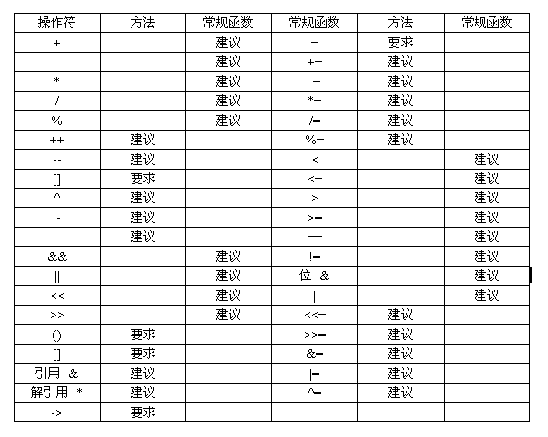

# 第十六课
迈着沉重的脚步，我们坚持学习编写 Haiku 应用，现在总算到了最后的课程，您可能非常激动，我们总算快学完了 C++，但是该语言还有许多特性有待我们学习。接下来我们将会谈到它们，因为它们是学习编写 Haiku 程序所必须的内容。

## 函数和操作符重载

通常，您可能会认为重载是您不希望用到的东西，如电源回路过载。在 C++ 中，它是我们总是在做的东西，用于扩展语言操作符和已存在函数的使用。函数重载定义了一个函数的不同版本，它们具有不同的参数。操作符也是函数，因此我们可以在自定义的类中添加或者减少信号以使之更好的继承其余的 API。这可以让我们的对象更加的自由方便。

在上一节的项目中，可以看到在我们生成窗口标题时，第一次使用了 BString 中的操作符重载。如下所示：

    BString labelString("Clicks: ");
     
    // 添加fCount的值到labelString的结尾。更多内容参见下一节。
    labelString << fCount;

通常 `<<` 操作符用于二进制左移位，但是在 BString 中则不同。`<<` 操作符已经进行了重载，作为 Append() 方法的更为方便的快捷方式，将 fCount 转换为字符串，并且添加到 labelString 的末尾。C++ 中的任何操作符都可以进行重载，包括尖括号，用于函数调用的圆括号，以及箭头操作符。

和 C++ 的其他特性相同，可以利用这一能力来完成某些操作，但这不是必需的。让 `+` 操作符执行减法操作只会带来身心的负担。例如，除了在极少数情况，重载操作符应该对所有的对象都执行同样的操作。只有这样，您才能够放置疑惑的产生，并减轻负面效果。

在极少数情况下，操作符函数可以实现为方法，如类得得一部分，或者常用函数。这样才能够带来“共同的利益”。下面是 `+` 操作符可能重载的两种方式：

* Method:

        MyClass operator+(const MyClass &from);

* Regular function:

        MyClass operator+(const MyClass &first, const MyClass &second);

其他所有的二进制操作符都遵循这种格式。作为一个常用的规则，使用二进制操作符来替换常用函数，这样可以使用相应的对象而无需执行很多输入。只能够重载为方法的操作符是赋值（'`=`'），函数调用（'`()`'），下标（'`[]`'），以及成员选择（'`->`'）。其他赋值操作符，如 `+=` 和`/=` 可以作为方法，但不是必需的。

一元操作符的实现遵循以下格式：

* Method:

        bool operator!(void) const;
		
* Regular function:

        bool operator!(const MyClass &target);

还有一些特殊用途的操作符需要特别留意。首先，考虑一下 `++` 和 `--` 操作符？它们都有两种不同的使用方式。这也就意味着它们具有两种不同的重载方式。在重载时，必须实现前缀（`++i`）和后缀（`i++`）两种不同的版本。

    Class MyClass:
    {
        // 前缀操作符
        MyClass operator++(void);
     
        // 后缀操作符。整型只是一个虚拟的参数，
        // 以便区分这两者。
        MyClass operator++(int dummy);
    }

下标操作符（"`[]`"）也是一个特殊情况，因为它可以位于赋值的任意一边。它必须重载为一个方法，因此也只有一种方法来实现。

    MyClass & operator[] (const int index);

为了便于牢记这些难于记忆的信息，下面这个表格将它们整理到了一起，极为详尽。

## 复制构造函数

在上一节课中学了构造函数和析构函数，我们已经了解了其基本应用，但是却遗留了一个相关的内容：复制构造函数，但是当我们在处理浮点数的问题时需要提及它。

float 类型并不是很精确。将 50 或者 100 个浮点数相加，即使您使用计算器来相加，您也无法得到希望获取的正确结果。这个问题源于它们在内存中的存储方式。通常，这不是什么大问题，但是如果我们编写一个个人理财程序，任何凑整的错误都将会导致严重的问题。我们创建一个类型，其精确到两位小数并且没有错误。首先我们定义一个基本类和一个进行快速测试的 main() 函数。

    #include <SupportDefs.h>
    #include <stdio.h>
     
    class Fixed
    {
    public:
    		Fixed(void);
    		~Fixed(void);
    	float	GetValue(void);
    	void	SetValue(const int64 &value);
     
    private:
    	Int64	*fValue;
    };
     
    Fixed::Fixed(void)
    {
    	fValue = new int64();
    	*fValue = 0;
    }
     
    Fixed::~Fixed(void)
    {
    	delete fValue;
    }
     
    float
    Fixed::GetValue(void)
    {
    	Return	float(*fValue) / 100.0;
    }
     
    Void
    Fixed::SetValue(const int64 &value)
    {
    	*fValue = value *100;
    }
     
    int
    main(void)
    {
    	Fixed f;
    	f.SetValue(1234);
     
    	printf("Value: %f\n", f.GetValue());
    	return 0;
    }

这段代码本身并不复杂。我们有四个 public 方法：构造函数，用于为 fValue 分配堆内存并将其值初始化为 0；析构函数，将 fValue 的堆内存释放；以及用于获取和赋予对象值的方法。

我们的 fixed 类提供的方法是，我们使用常规整型来保存浮点值以避免凑整产生的错误。数字的后两位保留为小数部分，这样我们就可以将任意数值乘以 100 后添加到我们的 Fixed 类，将我们 Fixed 类的值除以 100 后供外部使用。目前似乎一切顺利，让我们把 main() 函数略加修改：

    int
    main(void)
    {
    	Fixed f1;
     
    	if (f1.GetValue() == 0)
    	{
    		Fixed f2;
    		f2.SetValue(1234);
    		f1 = f2;
    	}
    	printf("Value: %f\n", f1.GetValue());
    	return 0;
    }

如果在 Haiku 下编译运行，第一次一切看起来很好，但是这里面存在两个非常难于发现的小问题，只有当我们的程序更为复杂之后才会出现：在我们的变量 f1 中 fValue 中保存的地址被清除了两次，而且还有内存泄露。相比内存泄露而言，同一地址删除两次要严重的多，因为它们可能会潜在的让您的程序崩溃，并且崩溃的位置和问题的定位鲜有联系。更糟的是，修改代码会让它毫无征兆的在其他地方崩溃。

代码的问题在于 if 语句的最后一行并没有按照我们期望的那样执行。我们希望的是复制其值，但实际上复制的为指针。当 f2 在 if 语句的末尾走出其作用域之后，它的 fVAlue 值将被清除。但问题是 f1 的 fValue 指向了同一个地址。那么，f1，fValue 所指向的内存位置就是无效的。当您的程序结束，f1 被清除时，任何异状都可能发生。为程序分配的内存仍在天空中漂浮，直到操作系统为我们进行清理时，它们才会被释放。如果类似的事情发生在 Ubuntu Linux 中，那么将会打印出错误信息，但是对于 Haiku，没有任何提示。因为我们并没有被告知问题的存在，这将会造成更大的麻烦。

幸运的是，如果我们对此有了了解，修改它将非常容易。问题的根源是执行了一次浅层的拷贝。浅层对象并没有将对象属性的真正值放入其他对象。如果对象属性在栈中分配还好。堆分配属性需要深层拷贝。这只能够通过实现我们的复制构造函数来完成，那么这就是我们所要讲述的内容，赋值操作符重载。

复制构造函数是在对象需要重写使调用的函数。默认复制构造函数执行浅层复制，在许多情况下非常有效。但是，这里不行。我们需要为类定义添加两项内容：

    Fixed(const Fixed &from);
    Fixed &  operator=(const Fixed &from);

以上两个函数的实现如下：

    Fixed::Fixed(const Fixed &from)
    {
    	fValue = new int64();
    	*fValue = *from.fValue;
    }
     
    Fixed &
    Fixed::operator=(const Fixed &from)
    {
    	*fValue = *from.fValue;
    }

这样就复制了 fValue 中保存的地址的数值而不只是地址本身，也就是执行了深层拷贝。混乱之后的世界再度恢复平静，呜呼哀哉。

## 项目

接下来我们更近一步，完成这个类。也许有一天它取之可用。下面是一些操作符重载的声明，它们可以使我们的新类和其他的编程环境高度融合。

    Fixed operator+(const Fixed &first, const Fixed &second);
    Fixed operator-(const Fixed &first, const Fixed &second);
    bool operator<(const Fixed &first, const Fixed &second);
    Bool operator>(const Fixed &first, const Fixed &second);
    Bool operator<=(const Fixed &first, const Fixed &second);
    Bool operator>=(const Fixed &first, const Fixed &second);
    Bool operator!=(const Fixed &first, const Fixed &second);
    Bool operator==(const Fixed &first, const Fixed &second);

通过实现或测试这些常用函数来进行一些重载的联系。您可能也希望了解其他的操作符如何进行重载。