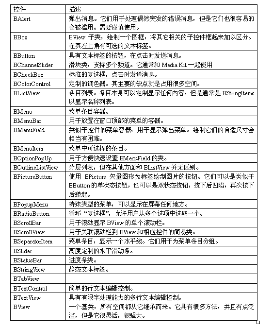

# 第十八课

我们已经学了有关菜单和按钮的内容，接下来我们将要开始学习其他可用的窗口控件类型，如下表所示：

上面给出了很多不同的类！乍看之下，乱花迷眼，但略加提炼，抑或稍加思考，您会发现她们形貌相仿，并非全异。您可能希望将这张表放在手边，以备不时之需。我们并不会对上述每个类都详细阐述，所略过的类都比较简单，非常易于理解。

## 重访类型转换

返回第七节，我们了解了类型转换，例如，将变量中的数据转译为其他不同的类型。在 C 语言中进行转换时存在的问题之一就是安全性 - 无论何时进行转换，它总会成功。如果您选择一个错误的类进行转换，它仍然会成功，这显然会造成无法预期的结果。C++ 提供了不同类型的转换。并且推荐使用 C++ 的转换方式，除非您是在编写 C 代码。如下所示：

`static_cast<TypeToCastTo *>(pointerToCast);`

static 转换用于将一种类型转换为其他类型。它依赖于编译期信息，并且通常用于常用的C转换方法的目的 - 修改指针类型和算术转换。仅当 C++ 语言支持的两种类型之间的转换时，它才会成功。

`dynamic_cast<TypeToCastTo *>(pointerToCast);`

和 static 转换不同，dynamic 转换将会是 Haiku 编程中最常用的转换类型方式。它们用于安全得导航到一个继承体系。如果继承没有将 “from” 和 “to” 类型链接到一起，那么就会返回 NULL。这样，您就仅可以转换为这些您认为可以转换的指针类型。我们将会在这节的项目中用到它们。

`const_cast<TypeToCastTo *>(pointerToCast);`

const 转换将会添加或者移除指针的可变度。例如，有一些实例中，函数将会接受一个非 const 参数，但不能够对其进行修改。传递一个常量指针给这些函数将会需要进行 const 转换。

`reinterpret_cast<TypeToCastTo *>(pointerToCast>;`

reinterpret_cast 转换很少使用。它将一个指针从一种类型转换为其他类型，而忽略这两者之间的相关性。基本上所有 reinterpret 转换可以完成的任务都可以由 static 转换来完成，并且其他的转换通常都不可移植，因此这种类型的转换仅用于确实需要的地方，例如转换函数指针类型。

## 项目：使用列表控件

本项目，称为 ListTitle，将会使用列表控件，即 BListView 类。在 Haiku API 中发现基于列表的控件使用轻量级的条目。BMenu 和BListView 实际上完成了大部分的工作，而 BMenuItem 和 BListItem 则是非常简单的类。以下面的方式设计类将会节约内存。

1. 在 Paladin 中新建一个项目，但是这次使用 “GUI with Main Window” 模板以节约部分输入 - 这个模板将会为 App 和 MainWindow 类创建基本的代码。
2. 我们的项目和目标命名为 ListTitile。
3. 完成创建后，打开 App.cpp，修改程序的 MIME 标识为 “application/x-vnd.test-ListTitle”，然后关闭。
4. 打开 MainWindow.h，在其顶部添加 ListView.h 头文件。
5. 在 MainWindow 类定义底部添加添加一个 “private:” 访问标号关键字。
6. 在 MainWindow 定义的 private 块中，声明属性 BListView *fListView。我们不仅仅在窗口构造函数中使用 fListView，因此使用指针将很有必要。

您的 App 类文件和 MainWindow.h 文件应该如下所示：

App.h
------------
    #ifndef APP_H 
    #define APP_H 
    #include <Application.h> 
    class App : public BApplication 
    { 
        public: 
        App(void); 
    }; 
    #endif

App.cpp
------------
    #include "App.h" 
    #include "MainWindow.h" 
    App::App(void) 
    : BApplication("application/x-vnd.test-ListColors") 
    { 
        MainWindow *mainwin = new MainWindow(); 
        mainwin->Show(); 
    } 
    
    int 
    main(void) 
    { 
        App *app = new App(); 
        app->Run(); 
        delete app; 
        return 0; 
    }

MainWindow.h
-------------
    #ifndef MAINWINDOW_H 
    #define MAINWINDOW_H 
    #include <Window.h> 
    #include <ListView.h> 
    class MainWindow : public BWindow 
    { 
    public: 
        MainWindow(void); 
        void MessageReceived(BMessage *msg);
    private: 
        BListView *fListView; 
    }; 
    #endif
	
现在进入正题：设置 MainWindow 的控件并且让它们有所动作。
打开 MainWindow.cpp，然后做如下修改：

MainWindow.cpp
------------------
    #include "MainWindow.h"
    #include <Button.h>
    #include <ListItem.h>
    #include <ScrollView.h>
     
    enum
    {
    	M_RESET_WINDOW = 'rswn',
    	M_SET_TITLE = 'sttl'
    };
     
    MainWindow::MainWindow(void)
    	:	BWindow(BRect(100,100,500,400),"The Weird World of Sports",
    			B_TITLED_WINDOW, B_ASYNCHRONOUS_CONTROLS | B_QUIT_ON_WINDOW_CLOSE)
    {
    	// 下面我们将创建一个BView，它将覆盖窗口内部所有白色区域，这样
    	// 我们就可以选择一个背景颜色。您将会希望在你的项目的窗口中这样
    	// 做 -- 您的项目看起来将会很专业。
    	BRect r(Bounds());
    	BView *top = new BView(r,"topview",B_FOLLOW_ALL,B_WILL_DRAW);
    	AddChild(top);
     
    	// ui_color()返回一个系统颜色，例如窗口标签颜色，菜单文本颜色，
    	// 等等。Panel Background颜色用于背景视图，如下所示。
    	top->SetViewColor(ui_color(B_PANEL_BACKGROUND_COLOR));
     
    	// 创建一个按钮，并将其放置在窗口的右下角。
    	// 用于BButton图框的BRect是空的，是因为我们将让其重设其尺寸，然
    	// 后根据按键的实际大小将其移动到右下角，因此无需指定其尺寸。
    	BButton *reset = new BButton(BRect(), "resetbutton", "Reset",
    					new BMessage(M_RESET_WINDOW),
    					B_FOLLOW_RIGHT | B_FOLLOW_BOTTOM);
    	top->AddChild(reset);
    	reset->ResizeToPreferred();
     
    	// 将按钮放置到窗口右下角，按钮与窗口边界的间隙为10个像素。
    	// 10个像素某种程度上说是用于控件填充的事实标准。它已经足以
    	// 让控件看起来不拥挤，并且也不占用大量空间。
    	reset->MoveTo(Bounds().right - reset->Bounds().Width() - 10.0,
    	Bounds().bottom - reset->Bounds().Height() - 10.0);
    	r = Bounds();
    	r.InsetBy(10.0,10.0);
     
    	// 使用BScrollView，在确定关联到BScrollView的控件尺寸时，您
    	// 必须补偿用于滚动栏的宽度/高度。B_V_SCROLL_BAR_WIDTH是用于
    	// 水平滚动栏宽度的已定义常量。
    	r.right -= B_V_SCROLL_BAR_WIDTH;
     
    	// 图框和Bounds()原理相似，除了它会返回控件在父视图坐标空间内
    	// 的尺寸和位置。这会使fListView得底部停靠在控件上方 10 个像素
    	// 的地方。
    	r.bottom = reset->Frame().top - 10.0 - B_H_SCROLL_BAR_HEIGHT;
     
    	// 这些参数多数和BView相同，除了我们也可以指定是否用户能够在列
    	// 表中选择单个条目或者点击条目时按下键盘上修饰键选择多个项目。
    	fListView = new BListView(r, "colorlist", B_SINGLE_SELECTION_LIST, 
    					B_FOLLOW_ALL);
     
    	// 我们在fListView上并未调用AddChild(),因为BScrollView将会为我们
    	// 完成这个操作。创建时，它创建了滚动栏并且把指定的视图作为其执行
    	// 滚动时的目标。在BScrollView关联到窗口时，它会为我们调用fListView
    	// 上的AddChild()。
    	// 如果我们在创建滚动视图前，调用了fListView的AddChild()，当我们在
    	// BScrollView中调用AddChild()时，我们的程序将进入调试器 -- 一个视
    	// 图仅可以有一个父视图。
    	BScrollView *scrollView = new BScrollView("scrollview", fListView, 
    							B_FOLLOW_ALL, 0, true, true);
    	top->AddChild(scrollView);
     
    	// 任何时候列表选择状态发生改变，都会向窗口发送 BListView
    	// 的选择消息。
    	fListView->SetSelectionMessage(new BMessage(M_SET_TITLE));
     
    	fListView->AddItem(new BStringItem("Toe Wrestling"));
    	fListView->AddItem(new BStringItem("Electric Toilet Racing"));
    	fListView->AddItem(new BStringItem("Bog Snorkeling"));
    	fListView->AddItem(new BStringItem("Chess Boxing"));
    	fListView->AddItem(new BStringItem("Cheese Rolling"));
    	fListView->AddItem(new BStringItem("Unicycle Polo"));
    }
     
    void
    MainWindow::MessageReceived(BMessage *msg)
    {
    	switch (msg->what)
    	{
    		case M_RESET_WINDOW:
    		{
    			fListView->DeselectAll();
    			break;
    		}
    		case M_SET_TITLE:
    		{
    			int32 selection = fListView->CurrentSelection();
    			if (selection < 0)
    			{	
    				// 这个代码之所以在这里是因为我们按下 Reset按钮时，
    				// 选取状态改变，并发送 M_SET_TITLE。但是由于并未
    				// 选中任何内容，CurrentSelection()返回 -1。
    				SetTitle("The Weird World of Sports");
    				break;
    			}	
     
    			BStringItem *item = dynamic_cast<BStringItem*>(
    							fListView->ItemAt(selection));
    			if (item)
    				SetTitle(item->Text());
     
    			break;
    		}
     
    		default:
    		{
    			BWindow::MessageReceived(msg);
    			break;
    		}
    	}
    }

这个项目和上节中的项目并没有太多不同之处。通过调用 BListView 的 SetSelectionMessage() 方法，我们让标题能够在用于点击列表中的条目时及时进行更新。通常我们使用 BListView 时，并不会使用这个方法。相对使用更加频繁的是：

SetInvocationMessage()，用于在用于双击条目时发送消息。需要注意的是，DeselectAll() 也会引起选中消息的发送，即使并没有选择，因此有必要处理这种情况，当 CurrentSelection() 返回负值时，标明没有选择。
幸好您已经对 BView 和常用控件如何一起应用到程序中有所感觉。它们大多数都需要使用 BRect 标识其尺寸和位置，const char * 标识控件名称的，两个整型标识其尺寸修改模式和其他的行为标志。许多类也具有标签和当控件修改或调用时发送的消息，有其是那些继承自 BControl 的类。控件创建后，它将通过 AddChile() 函数关联到 BWindow 或 BView。控件发送的消息通常发送到其所关联到的窗口，但是它也可以定位到其他目标，例如其父类 BView 或者全局的 BApplication。

## 需要记住的内容

### BControl

* ResizeToPreferred(void) - 子类调用它调整自己至合适尺寸以显示其标签和内容。
* SetLabel(const char *label)/const char * Label(void) - 用于获取和设置子类的标签的方法。
* SetTarget(BHandler *handler, BLooper *looper) - 发送调用小弟到不同的目标，如 BView，BWindow，或者 BApplication。
* void SetEnabled(bool enabled)/bool IsEnabled(void) - 用于获取和设置控件启用/禁用状态的方法。

### BListView

* AddItem(BListItem *item) - 添加条目到列表。
* int32 CountItems(void) - 返回列表中条目的数量。
* BListItem *RemoveItem(int32 index) - 移除并返回指定索引的条目，如果不存在，则返回 NULL。
* void RemoveItem(BListItem *item) - 从列表中移除指定条目。如果列表中不存在，则不作任何动作。
* int32 CurrentSelection(int32 index = -1) - 返回当前选中项目的索引，如果不存在，则为 -1。index 参数用于获取支持多条目选择的列表中所有的选中项目。通常会有一个 while() 循环来获取所有的条目标记，并且当返回 -1 是，它将会退出。
* void Select(itn32 index, bool extend = false) - 从指定索引中选择条目。如果extend为false，在指定条目选定前，所有其他的条目将会取消选定。
* void Select(int32 start, int32 end, bool extend = false) - 选中 start 到 end 之间的所有条目。如果 extend 为 false，在指定条目选定前，其他的所有条目取消选定。
* void DeselectAll(void) - 取消选定列表中的所有条目。