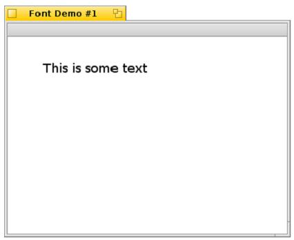

字体是一些人需要重复温习的内容之一（那些毫无理由的收集了很多喜欢的东西人），其他人可能很少关心过这些东西。不管您站在那边，了解一下如何在 Haiku 中管理文本的显示也是非常有用的。

## 在 Haiku 中使用字体

与 Haiku 中其他的附加组件一样，用户可以在系统中用于保存字体的文件夹中添加自己喜欢的字体。您可以使用 find_directory()来获取，即 B_COMMON_FONTS_DIRECTORY，在 Haiku 中，其对应于 /boot/common/data/fonts，而对于 BeOS R5 和 Zeta，则为 /boot/home/config/fonts 。在 R5 和 Zeta 中，字体需要分别放入相应的子文件夹，ttfonts 用于 TrueType 字体，而 psfonts 则用于 PostScript。Haiku 移除了这一限制。当然 Haiku 中，在新安装完字体之后，您也不需要重启系统，可以直接使用。

相对于 BeOS R5 时代，字体的处理已经有了很大的改变。对于一些 BeOS 用户来说，文本渲染总是一块心病。R5 并没有提供文本抗锯齿处理。这种情况在 Zeta 中作了相应的提高，因为它使用了一种不同的字体引擎，由著名的字体公司 Bitstream 所开发。然而，这些提升仅能够用于 Zeta。对于 Haiku，则使用了开源的 FreeType 库提供优秀的字体渲染，并且提供了比之前更多类型的可用字体。

## 排版简介

如果在介绍字体时，对有关排版的背景不作介绍，它总是不完整的，排版是为各种类型的打印而作排布的过程。排版的基础起始于古登堡活版印刷，至今已经变得非常的复杂。当然在您的应用中使用文本，并不需要深入的掌握排版知识的所有细节，但是对一些术语的了解将会非常有用。

字体构成不同的字体集。字体集并不仅仅是一个名称。例如，Times New Roman，Century Schoolbook L，以及Helvetica都是非常有名的字体集。每个字体集都包含了一种或多种独立的样式或外观。虽然您可以很容易分辨出相似的斜体（Italic）和粗体（Bold），但是字体集并不是这个意思。有时候在讨论样式时，您会听到字号（Font Weight）这一术语。字号是样式的不同表示。下面是字号的不很详尽的列表，从最轻至最重的字体。

* Extra light
* Light
* Book
* Normal/Regular/Plain
* Medium
* Demi-bold
* Bold
* Black
* Extra Black

字体集通常分为不同的类别。使用的类别取决于您的要求，但是对于我们来说，我们使用三种基本类别：serif，sans serif，和 decorative。Serif 字体在拉丁文中最为常见。Serif 是处在在特定位置的字符的装饰笔画。而在 sans serif 字体中则没有这些装饰。Decorative 字体通常用于商标或者特殊效果。下面是大写字母R在三种不同字体中的表示：

Times New Roman 是一种 serif 字体，Arial 属于 sans serif字体，而 Wingdings 属于 decorative 字体。

除了上述的术语，您还需要了解一下的内容：

* 行距（leading） - 与单词 “bedding” 押韵，其用于指明文本两行之间的距离空间。
* 子模（glyph）- 字体中所使用的字符。根据字体的不同，它可以是字符，数字或者其他的内容。
* 字距（Kerning） - 两个字符之间的水平距离。等比例字体，字体没有固定的宽度，为了阅读的方便，在其字符之间使用了不同的字距。
* 基线（baseline） - 确定字符放置位置的虚拟线。
* 上格（ascender）- 表示位于其他字符上方的小写字符部分，例如字符 d 的上半部分。
* 下格（descender） - 位于基线以下的小写字符部分，例如字符 p 的下半部分。
* 点格（point）- 点格是计数单元，用于和像素相区别。在一个英寸上有72个点。（中国可以称之为字号，如初号对应于42 points，而八号对应于5 points）。

## 字体的处理

字体可能是一个复杂的内容，但是如果您只是希望在屏幕上打印出文本，您该怎么做呢？这不算个问题。让我们从最简单的示例说起：在 BView 中显示文本。

* 在 Paladin 中创建一个带有 GUI 和 Menu 模板的 Main Window 的项目。
* 打开 App.cpp，将该应用署名改为 “application/x-vnd.test-FontDemo1” 并保存。
* 新建文件 MainView.cpp，然后选中并创建其头文件。之后开始下面的任务。

### MainWindow.cpp

	#include “MainWindow.h”
	#include <Application.h>
	#include <Menu.h>
	#include <MenuItem.h>
	#include <View.h>

	#include “MainView.h”

	MainWindow::MainWindow(void)
		:	BWindow(Rect(100,100,500,400), “Font Demo”, B_TITLED_WINDOW,
				B_ASYNCHRONOUS_CONTROLS)
	{
		BRect r(Bounds());
		r.bottom = 20;
		fMenuBar = new BMenuBar(r, “menubar”);
		AddChild(fMenuBar);
		
		r = Bounds();
		r.top = 20;
		MainView *view = new MainView(r);
		AddChild(view);
	}

	void
	MainWindow::MessageReceived(BMessage *msg)
	{
		switch (msg->what)
		{
			default:
			{
				BWindow::MessageReceived(msg);
				break;
			}
		}
	}

	bool
	MainWindow::QuitRequested(void)
	{
		be_app->PostMessage(B_QUIT_REQUESTED);
		return true;
	}

### MainView.h

	#ifndef MAINVIEW_H
	#define MAINVIEW_H

	#include <View.h>
	class MainView : public BView
	{
	public:
				MainView(const BRect &frame);
		void		Draw(BRect update);
	}
	#endif

### MainView.cpp

	#include “MainView.h”
	MainView::MainView(const BRect &frame)
		:	BView(frame, “textview”, B_FOLLOW_ALL, B_WILL_DRAW)
	{
	}

	void
	MainView::Draw(BRect update)
	{
		// Draw 钩子函数在BView要求在屏幕上重绘自己时调用。
		// 我们只是用一些代码来绘制文本。
		BFont font;
		font.SetSize(18.0);

		SetFont(&font);

		// DrawString 是用BView的当前字体设置，绘制模式，以及
		// 颜色来绘制文本。需要注意的是指定的点为基线的最左端，
		// 因此和其他内容的绘制相比，文本绘制位置需要一些推演。
		DrawString(“This is some text”, BPoint(50,50));
	}

上述的实例可能已经是最简单的了。运行这个演示程序，其窗口结果如下：

BView 的 Draw() 方法并不仅限于绘制文本，但是我们在这里不再赘述，留与其他课程。在这里需要注意，MainView 类得图形状态仅当我们修改时才会发生变化，例如打开位置，字体大小，当前高亮颜色等等。如果这样，我们可以将除 DrawString() 调用之外的其他内容转移至构造函数以使绘制更加快速，但是这种优化仅适用于简单的控件。

## 可用的内容

如果您快速的浏览一下Font.h文件，您会发现BFont类有很多不同的方法。其中很大部分都用于特殊用途，例如选择不同编码，翻转文本。下面我们将介绍您最常用的方法：

	void GetHeight(font_height *height) const;
获取字体的行距，最大上格高度，和最大下格大小，并且包括当前字体的大小的像素。font_height 只是一个包含三个浮点数的结构体（struct）：ascent，decent，和leading。如果您希望了解使用该字体打印一行文本的安全像素高度，则调用该函数，然后将这三个值加起来即可。

	void TruncateString(BString *string, uint32 mode, float maxWidth);
该方法从字符串中获取字符，直到其到达 maxWidth 像素。其具有四种模式：B_TRUNCATE_BEGINNING，B_TRUNCATE_MIDDLE，B_TRUNCATE_END，及B_TRUNCATE_SMART。前三个模式非常容易明白。根据 Be Book，最后一个必须与 GetTruncatedStrings() 一起使用，以便剪切字符串，使他们能够各不相同，并且关注字符边界，分隔符，标点符号等。在 R5 中，其并未实现。Haiku 中，其实现方式与 B_TRUNCATE_MIDDLE 相同。

	bool IsFixed(void) const;
如果字体为等快字体，则返回真。

	void SetFace(uint16 face);
	uint16 Face(void) const;
设置或者获取字体外观。除了字符值，这些调用还有赖于整型常量，如果您希望指定某种样式且不希望了解其名称，将会非常方便。下面是外观常量：

* B_ITALIC_FACE
* B_UNDERSCORE_FACE
* B_NEGATIVE_FACE
* B_OUTLINED_FACE
* B_STRIKEOUT_FACE
* B_BOLD_FACE
* B_REGULAR_FACE
* B_CONDENSED_FACE*
* B_LIGHT_FACE*
* B_HEAVY_FACE*

带有 * 号得 CONDENSED，LIGHT，HEAVY 外观常量是 Haiku 所新添的，在 Zeta 或者 BeOS R5 中不可用。

	void SetFamilyAndFace(const font_family family, uint16 face);
	void SetFamilyAndStyle(const font_family family, const font_style style);
	void SetFamilyAndStyle(font_family *family, font_style *style);
这三个方法可以方便的获取和设置指定字体样式。

	void SetSize(float size);
	float Size(void) const;
设置字体的点格（Point）大小。在本书编写时，Be Book 对其限制为 1000 points，而 Haiku 与其不同，并没有该限制。

	float StringWidth(const char* string) const;
	float StringWidth(const char* string, int32 length) const;
返回当前大小字符串的宽度。

	int32 count_font_families(void);
	int32 count_font_styles(font_family family);
	status_t get_font_family(int32 index, font_family* family, uint32* flags = NULL);
	status_t get_font_style(font_family family, int32 index, font_style* style, uint32* flags = NULL);
用于迭代读取系统中安装的所有字体的全局函数。

## 其他的提示和技巧

* 有三个全局字体对象：be_plain_font ，be_bold_font，be_fixed_font。这些内置对象由用户通过字体首选项设置。在您的程序中尽可能使用这些字体可以保持外观界面的协调一致。
* 如果您在给定颜色的背景上绘制文本，请确保将视图的低颜色设置为背景，否则您的文本看起来会有点诡异。
* 在图片背景上绘制文本时，在文本绘制前，将视图的绘制模式设为 B_OP_ALPHA。
* 在处理字距时，可以使用与退格相关的方法对其进行微调。

## 深入了解

* 尝试摆弄一下与 Haiku 绑定的字体演示程序。感受每个不同的特效如何改变文本。
* 尝试使用 BMessageRunner 创建一些动态的文本演示，如修改大小，翻转文本，或者其他有趣的效果。
