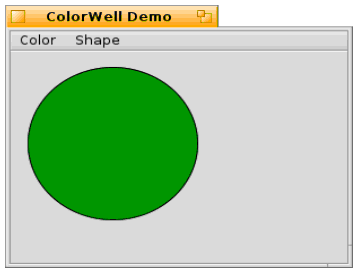

界面套件（Interface Kit）全部用于创建和使用图形界面中的控件。在一些早期的课程中，我们接触到了套件中存在的一些控件，但是为了充分理解和使用它们，我们需要创建自定义的控件。为此，我们需要了解界面套件的不同部分，以便更有效地加以利用。

## Haiku 控件方式

如果您从事编程已经有了一段时间，您可能知道了一些好的代码设计模式。如果还没有，您可以从 Haiku 的 API 中获得此道。Be Inc. 的开发人员非常谨慎的设计了一套 API 并且使之非常易于使用。其中也使用了一些范式，在一些特定的场合可以加以巧妙的使用。

在界面套件中控件设计的一项内容就是使用轻量级对象来构建列表。BListView 和BOutlineListView 类就是最好的证明。它们都可能会包含很多项目，因此每一个都必须占据尽可能小的空间。BStringItem 对象，根据自己的列表进行相应的绘制，而不是每个对象单独的作为BView对象进行。它们只关心很少的数据，比如 BStringItem 的例子。

洁面套件中常用到的另一个规则是尽可能使用已经存在的类实现您的控件。例如，BTextControl 只是 BTextView 单行显示的一个特殊情况。通过在您的控件中使用标准的控件而不是重新进行实现，您可以保持界面对用户的一致性。

与您的控件进行交互的 API 应该遵循界面套件的其他类中所用的惯例。提供事件的钩子函数。如果您的控件具有一个值和一个标签，最好使其作为 BControl 的子类。需要注意的是，并不是界面套件中的所有控件都需要这样，如 BListView。如果您不适用 BControl 子类，混合使用 BInvoker 类则可以很容易的修改消息目标对象，并且可以为控件的消息处理提供相似的接口。将数据返回函数编写为 const 函数，这样可以显示的告诉编译器它们不改变对象的状态。最后，除非套件中不存在可用于并且适合于当前任务的控件时，不要添加新控件。通常可以将一个或多个控件组合来完成需要添加专门控件来完成的任务。Work smarter, not harder。

## 我们的新控件：ColorWell

Haiku  API 所缺少的控件类型是颜色显示控件。除了图像和文本，Haiku 也允许将颜色拖拽至其他位置。我们将创建一个色彩，用于保存和显示颜色值，并且支持拖拽颜色至其他位置，并且接受拖拽的颜色。需要注意的是，我们并不会创建一个颜色拾取工具来修改颜色，这个任务可以由 BColorControl 类来完成。

对于控件，我们还需要将一些内容牢记于心。首先，颜色可以由32位整型或者 rgb_color 对象来表示，因此我们需要同时支持这两种方式的颜色赋值和返回。其次，我们需要同时提供圆形和矩形两种样式，以满足程序中可能出现的需要。第三，我们需要能够禁用该控件，因此我们需要为控件设计一种禁用状态下的外观，并且要能够很容易分辨。

下面是我们的头文件：

### ColorWell1.h

	#ifndef COLOR_WELL_H
	#define COLOR_WELL_H

	#include <Control.h>

	enum
	{
		COLORWELL_SQUARE_WELL,
		COLORWELL_ROUND_WELL,
	};

	class ColorWell : public BControl
	{
	public:				ColorWell(BRect frame, const char* name,
		BMessage* msg,
		int32 resize = B_FOLLOW_LEFT | 
		B_FOLLOW_TOP,
		int32 flags = B_WILL_DRAW,
		int32 style = COLORWELL_SQUARE_WELL);
		~ColorWell(void);
		virtual void		SetValue(int32 value);
		virtual void		SetValue(const rgb_color &color);
		virtual void		SetValue(const uint8 &r, const uint8 &g,
		const uint8 &b);
		rgb_color		ValueAsColor(void) const;
		virtual			SetStyle(const int32 &style);
		int32		Style(void) const;
		virtual void		Draw(BRect update);
	private:
		void			DrawBound(void);
		void			DrawSquare(void);
		rgb_color	fDisabledColor;
		fColor;
		int32		fStyle;
	}

	#endif

看了上面的类，思考一下该如何实现这些方法。

在我们进行编写代码之前，我们来快速了解一下 BView 如何来进行绘制。BView 对自己的绘制需要经过四个步骤：无效激活，绘制，子视图绘制，深层子视图绘制。无效激活是指 BView 告诉 app_server 其区域中的某块需要重绘。无效区域可能由多种情况产生，如窗口隐藏了其部分内容，现在它不希望继续隐藏，或者内部的值发生变化，BView 需要更新期标签。之后，BView 将会开始进行自我重绘，这由 Draw() 钩子函数处理。在视图进行自我绘制时，其需要确保其子视图按需要进行重绘。当然也可以在其所有的子 BView 完成更新之后，再进行 BView 绘制。而这类绘制通过 DrawAfterChildren() 钩子函数来完成。尽管该函数并不常用。

## 编写ColorWell代码

### ColorWell1.cpp

	#include "ColorWell1.h"
	
	ColorWell::ColorWell(BRect frame, const char* name, BMessage* message,
		int32 resize, int32 flags, int32 style)
		: BControl(frame, name, NULL, message, resize, flags)
	{
		SetViewColor(ui_color(B_PANEL_BACKGROUND_COLOR));
		SetLowColor(0,0,0);
		
		fColor.red = 0;
		fColor.green = 0;
		fColor.blue = 0;
		fColor.alpha = 255;
		
		fDisabledColor.red = 190;
		fDisabledColor.green = 190;
		fDisabledColor.blue = 190;
		fDisabledColor.alpha = 255;
	}

	ColorWEll::~ColorWell(void)
	{
	}

	void
	ColorWell::SetValue(int32 value)
	{
		//通过整型来进行颜色赋值看起来可能有点奇怪，但是它是
		// BControl驱动的控件所期望的，因此我们需要尽可能的支持。
		BControl::SetValue(value);
		
		// int32 可用于传递颜色，因为它包含了4个8位的整型。将它
		// 们转换为RGB格式需要一些移位操作。
		fColor.red = (value & 0xFF000000) >> 24;
		fColor.green = (value & 0x00FF0000) >> 16;
		fColor.blue = (value & 0x0000FF00) >> 8;
		fColor.alpha = 255;
		
		SetHighColor(fColor);
		Draw(Bounds());
	}

	void
	ColorWell::SetValue(const rgb_color &col)
	{
		fColor = col;
		fColor.alpha = 255;
		// 因为BControl::Value()需要返回恰当的值而忽略值的赋值形式，
		// 所以需要调用该方法的BControl版本。
		BControl::SetValue((fColor.red << 24) + (fColor.green << 16) +
		(fColor.blue <, 8) + 255);
		SetHighColor(col);
		Draw(Bounds());
	}

	void
	ColorWell::SetValue(const uint8& r, const uint8& g, const uint8 &b)
	{
		fColor.red = r;
		fColor.green = g;
		fColor.blue = b;
		fColor.alpha = 255;
		
		BControl::SetValue((fColor.red << 24) + (fColor.green << 16) +
		(fColor.blue << 8) + fColor.alpha);
		SetHighColor(r, g, b);
		Draw(Bounds()); 
	}

	void
	ColorWell::SetStyle(const int32& style)
	{
		if (style != fStyle)
		{
		fStyle = style;
		Invalidate();
		}
	}

	int32
	ColorWell::Style(void) const
	{
		return fStyle;
	}

	void
	ColorWell::Draw(BRect update)
	{
		if (fStyle == COLORWELL_SQUARE_WELL)
		DrawSquare();
		else
		DrawRound();
	}

	rgb_color
	ColorWell::ValueAsColor(void) const
	{
		return fColor;
	}

	void
	ColorWell::DrawRound(void)
	{
		// 真正的控件需要更多的工作以便让它更为美观，
		// 但是在这里我们只需要一个简单的黑色边框即可。
		if (IsEnabled())
		SetHighColor(fColor);
		Else
		SetHighColor(fDisabledColor);
		
		FillEllipse(Bounds());
		
		SetHighColor(0,0,0);
		StrokeEllipse(Bounds());
	}

	void
	ColorWell::DrawSquare(void)
	{
		// ColorWell的矩形版本并不会比圆形复杂
		if (IsEnabled())
		SetHighColor(fColor);
		else
		SetHighColor(fDisableColor);
		
		FillRect(Bounds());
		;
		SetHighColor(0,0,0);
		StrokeRect(Bounds());
		
	}

上述这些方法都不需要太多的思考。这并不奇怪。Haiku 提供的用于创建控件的框架已经提供了足够的特性，它们足以完成很多重要的任务，并且不会很复杂。现在我们完成项目剩余的工作，使用必要的 GUI 测试我们的新控件。

### App.h

	#ifndef APP_H
	#define APP_H

	#include <Application.h>
	class App : public BApplication
	{
	public:
		App(void);
	};
	#endif

### App.cpp

	#include "App.h"
	#include "MainWindow.h"
	App::App(void)
		:	BApplication("application/x-vnd.jy-ColorWellDemol")
	{
		MainWindow *mainwin = new MainWindow();
		Mainwin->Show();
	}

	int
	main(void）
	{
		App *app = new App();
		App->Run();
		delete app;
		return 0;
	}

### MainWindow.h

	#ifndef MAINWINDOW_H
	#define MAINWINDOW_H

	#include <Window.h>
	#include <MenuBar.h>

	class ColorWell;

	class MainWindow : public BWindow
	{
	public:
		MainWindow(void);
		void 		MessageReceived(BMessage* msg);
		bool			QuitRequested(void);
	private:
		BMenuBar*	fMenuBar;
		ColorWell*	fColorWell;
	};
	#endif

### MainWindow.cpp

	#include "MainWindow.h"

	#include <Application.h>
	#include <Menu.h>
	#include <MenuItem.h>
	#include <View.h>
	#include "ColorWell1.h"

	enum
	{
		M_SET_COLOR = 'stcl',
		M_COLOR_UPDATED = 'mcup',
		M_SET_SHAPE_CIRCLE = 'sscr',
		M_SET_SHAPE_SQUARE = 'sssq'
	};

	MainWindow::MainWindow(void)
		:	BWindow(BRect(100,100,500,400), "ColorWell Demo",
		B_TITLED_WINDOW, B_ASYNCHRONOUS_CONTROLS)
	{
		BRect r(Bounds());
		R.bottom = 20;
		fMenuBar = new BMenuBar(r, "menubar");
		AddChild(fMenuBar);
		
		// 创建一个背景视图以使窗口看起来正常些。如果您在
		// BWindow中有一组控件，最好创建一个背景视图。
		r = Bounds();
		r.top = 20;
		BView* background = new BView(r, "background", B_FOLLOW_ALL,
		B_WILL_DRAW);
		
		// SetViewColor() 设置视图的背景颜色。ui_color() 是一个全局的
		// C++ 函数，用以返回给定系统颜色常量的rgb_color值。	
		// B_PANEL_BACKGROUND_COLOR 恰好是BView默认的背景
		// 颜色，默认情况下其值为 (216,216,216)。
		background->SetViewColor(ui_color(B_PANEL_BACKGROUND_COLOR));
		AddChild(background);
		
		// 创建我们的color well 控件。它比实际需要时用到的要大，
		// 但是对于演示来说，还过得去。
		fColorWell = new ColorWell(BRect(15,15,165,165), "color well",
		new BMessage(M_COLOR_UPDATED));
		
		// 注意，我们在这里调用了背景视图的AddChild方法。如果
		// 两个具有相同父控件的视图彼此重叠，根据 Be Book，其结果
		// 将是不可预期的。但是，在多数情况下，可能会出现绘制错误，
		// 较晚添加的视图将无法获得鼠标焦点。
		background->AddChild(fColorWell);
		
		BMenu* menu = new BMenu("Color");
		fMenuBar->AddItem(menu);
		
		// BMessage可以附带数据。这样，它们就是非常方便的数据容器。
		// 下面我们将为每个彩色菜单条目的消息附带一个颜色。
		// 尽管这不是附加颜色的标准方法，但是在本实例中，它已经足以
		// 胜任了。
		BMessage* msg = new BMessage(M_SET_COLOR);
		msg->AddInt8("red", 160);
		msg->AddInt8("green", 0);
		msg->AddInt8("blue", 0);
		Menu->AddItem(new BMenuItem("Red", msg, 'R', B_COMMAND_KEY));
		
		msg = new BMessage(M_SET_COLOR);
		msg->AddInt8("red", 0);
		msg->AddInt8("green",160);
		msg->AddInt8("blue", 0);
		Menu->AddItem(new BMenuItem("Green", msg, 'G', B_COMMAND_KEY));
		msg = new BMessage(M_SET_COLOR);
		msg->AddInt8("red", 0);
		msg->AddInt8("green",0);
		msg->AddInt8("blue", 160);
		Menu->AddItem(new BMenuItem("Blue", msg, 'B', B_COMMAND_KEY));
		
		menu = new BMenu("Shape");
		fMenuBar->AddItem(menu);
		
		Menu->AddItem(new BMenuItem("Square",
		new BMessage(M_SET_SHAPE_SQUARE), 'S', B_COMMAND_KEY));
		Menu->AddItem(new BMenuItem("Circle",
		new BMessage(M_SET_SHAPE_SQUARE), 'C', B_COMMAND_KEY));
	}

	void
	MainWindow::MessageReceived(BMessage* msg)
	{
		switch (msg->what)
		{
		case M_SET_COLOR:
		{
		// 获取保存的颜色值，并将其放入ColorWell。
		int8 red, green, blue;
		msg->FindInt8("red", &red);
		msg->FindInt8("green", &green);
		msg->FindInt8("blue", &blue);
		
		fColorWell->SetValue(red, green, blue);
		break; 
		}
		case M_SET_SHAPE_CIRCLE:
		{
		fColorWell->SetStyle(COLORWELL_ROUND_WELL);
		break;
		}
		case M_SET_SHAPE_SQUARE:
		{
		fColorWell->SetStyle(COLORWELL_SQUARE_WELL);
		break;
		}
		default:
		{
		BWindow::MessageReceived(msg);
		break;
		}
		
		}
	}

	bool
	MainWindow::QuitRequested(void)
	{
		be_app->PostMessage(B_QUIT_REQUESTED);
		return true;
	}

在完成这些代码之后，构建你的程序，然后您就可以看到一个运行的演示程序，它将会显示一个彩色的样例，并且可以根据我们的需要修改相应的颜色。当然它只能够显示当前的颜色。目前它已经非常接近 BColorControl，因为您可以编辑颜色，并且可以将其显示。还不错。

## 最后思考

现在我们已经有了一个基本的控件。如果这是为了实现一个大型的项目，那么这个快捷而糟糕的类确实可以胜任，我们这样设计就已经足够了，但是如果目标是实现一个成熟全面的 Haiku 控件类，还需要进行更多的工作。但是通常您并不需要实现所有不同的需要放置到我们的 ColorWell 类中的组件，但是对这些特性使用的了解，可以让您的视野更加的开阔。

## 深入了解

这不仅仅是一个练习。它也是您的代码，因此尝试思考一下您可以在其他项目中如何使用该控件，或者您希望为其添加一些其他方便有益的特性。